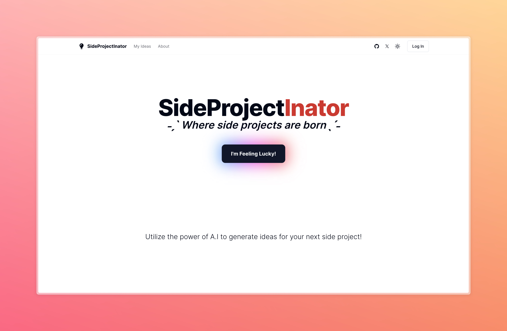

# SideProjectInator

Where side projects are born

## Description

Utilize the power of A.I. to generate ideas for your next side project. Simply click a button and let the SideProjectInator do the rest.

## What LLM is being used?

By default `llama2` is used via `Ollama`, that's because I don't want to pay for `ChatGPT` or any LLM. You can't beat free.

But, you're not locked in. You can use any LLM that supports `OpenAI`'s API spec.

